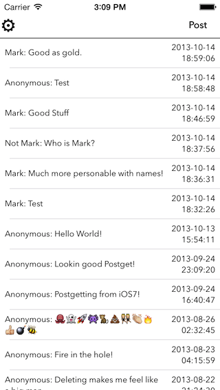

Simple-Message-Board-App
========================

A simple iOS app to post to and view a simple php message board on a web server.

This app was an exercise in connecting to a web based API to post, retrieve, and delete text messages on basic message board.

I wrote a very basic API using PHP, which is used to edit a MySQL database table containing the message, date, and name for each post.

Using the included PHP Scripts:

1. Rename pg-config-template.php to pg-config.php and insert your database details.

2. post.php, delete.php, pg-config.php, get.php and index.php should be located on your webserver in the same directory.

3. Run the included createtable.php script to create the database table, or build it yourself.

 
